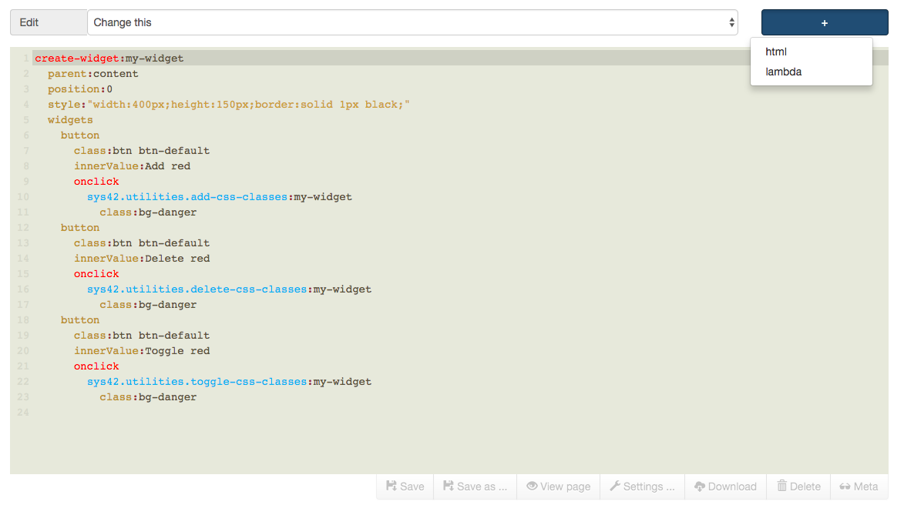

System42's "anti-CMS"
========

The CMS application is a pretty nifty publishing system, allowing you to create and publish your own websites and pages.
In addition to being able to create HTML in a WYSIWYG environment, it also allows for you to create _"lambda"_ pages. Below
is a screenshot of the CMS in System42.



A lambda page, is a page that instead of passing raw HTML to the client, allows you to create Hyperlambda that is evaluated
on the server. Ususally, you would want to create some sort of Ajax Widget hierarchy when creating your lambda pages. But you can
also create for instance web service pages, and pages without GUI in any ways if you wish.

To run the CMS, you need to be logged in as root.

Below is an example of content you might want to put into your lambda page, that creates a simple literal widget for you,
which once clicked, changes its innerHTML to _"Hello World!"_.

```
create-widget
  element:h3
  parent:content
  class:col-xs-12
  innerValue:Click me!
  onclick
    set-widget-property:x:/../*/_event?value
      innerValue:Hello World!
```

When you create a page, it is stored in the p5.data database as a *[p5.page]* object.

You can set several properties to your pages, such as their virtual URL, Name, which template to use, and so on. By default, System42's 
CMS comes with a handful of pre-defined templates, allowing you to create pages with a navbar navigation menu, a completely "empty" 
page, etc.

The CMS of System42 is also a reference/example implementation of a website/webapp created with Phosphorus Five.

## Folder structure

Below is the description of the main folders within System42 and what they do.

### The "initial-pages" folder

This folder contains the initial pages for your system. If you wish to distribute P5 and System42 with different initial
pages, feel free to modify these files as you see fit.

By default, only a single HTML page, in addition to the page necessary to start "apps" are created.

### The "installation" folder

This folder contains the files that will be evaluated during the initial setup of your server, and guides you through setting up a
server salt, root password, and other things necessary to "initialize" your server.

### The "media" folder

This folder contains CSS and other resource files, that System42 is dependent upon.

### The "page-editor" folder

This folder contains the actual CMS editor, and all of the plugins for the different types of pages that are in the system.
By default, there are only two types of pages in System42; HTML pages and _"lambda"_ pages. Lambda pages allows the user to instead
of loading up some static HTML, evaluate his own lambda script, to entirely create the page himself as he see fit, as a dynamic page. 

It still utilizes the templates, URL system, name, and so on. Unless you explicitly override these in your lambda page. You would
probably want to take advantage of these features, if you create your own lambda pages, which means making sure whatever widgets
you load into your page, using Hyperlambda, should be loaded within the "container" widget - Which is the default "root widget"
for your CMS.

If you wish to create your own page type, you'll need to add up a _"/page-editor/specialized-editor/"_ file, 
a _"/page-editor/new-page-templates/"_ file, in addition to creating your own _"/page-loader/"_ file. These files have the same name,
as your page *[type]* from its *[p5.page]* object in the database, and are automatically plugged into the CMS, as an entirely new
type of page.

You can use this logic to create your own custom blog engine, web service creation pages, etc, etc, etc.

You must have a specialized editor file, within _"/page-editor/specialized-editor/"_, and a page loader file, within 
the _"/page-loader/"_ folder. However, the default new page template, within the _"/page-editor/new-page-templates/"_ folder is optional,
and if not supplied, no default properties for your page will be created.

#### Extendibility

In general, as you can see above, the CMS in System42 is super extendible, allowing you to create your own custom pages, completely
taking control over all aspects of your page, from editing to loading. In addition, you can also both globally modify the toolbar,
by adding your own toolbar button(s) inside of the _"/page-editors/toolbar-buttons/"_ folder, or local toolbar buttons, for your 
specialized editor inside of the _"/page-editor/specialized-editor/xxx/toolbar-buttons/"_ folder, where _"xxx"_ is the *[type]* of
page you wish to create.

The _"lambda"_ page *[type]* for instance, have a specialized toolbar button, allowing you to verify, and view meta information about 
your *[lambda]* page. See the _"meta-info.hl"_ file inside of the _"/specialized-editors/lambda/toolbar-buttons/"_ folder to see an 
example of a page type specialized toolbar button.

### The "page-loader" folder

This folder, contains all the specialized "loaders" for your pages. See above the documentation for the "page-editor" folder to
understand how it works.

### The "page-templates" folder

This folder contains the skins, or templates if you wish, for your page objects. Whenever you create a new page in the CMS,
you can choose which template to use. Some templates have menus, some black, others white, others are completely empty, etc.
Exactly what templates your system has, dependes upon your installation, and how it is modified.

### The "startup" folder

All files inside of this folder, are automatically evaluated during startup of your server, and typically creates Active Events, 
and does other types of initialization the system is dependent upon to function accurately.

The most important file in this folder is the _"p5.web.load-ui.hl"_. This file creates an Active Event, which is raised by the
Phosphorus Five core or kernel, and is expected to serve documents according to URLs. It is given a single argument *[url]*, 
which is the relative URL to the page requested by the client.

